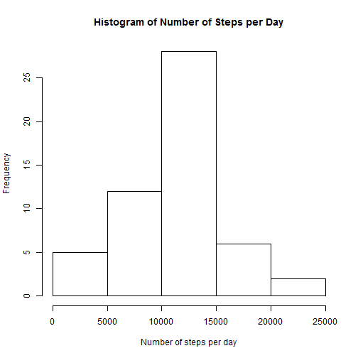
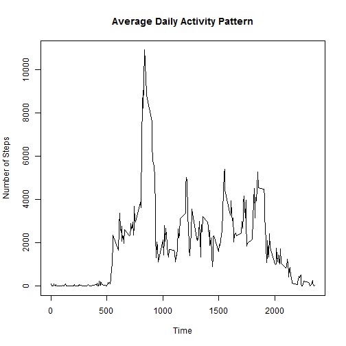
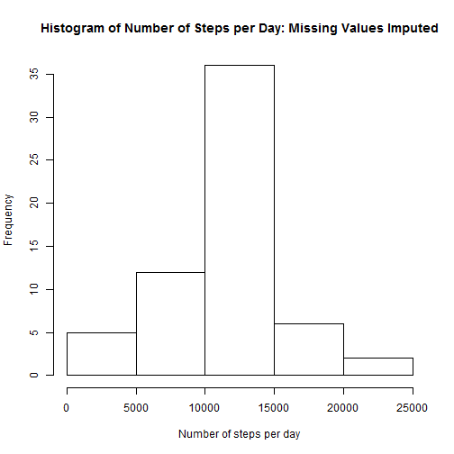
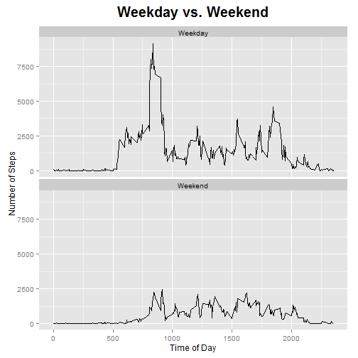

<<<<<<< HEAD

PROJECT 1

REPRODUCIBLE RESEARCH

AUTHOR: ABP

==========================================

READING IN DATA

The first step is reading in the dataset. This requires placing the activity.csv file in the working directory.


```r
data <- read.csv("activity.csv", stringsAsFactors=FALSE)

library(stringr) 
library(plyr) 
library(dplyr) 
library(lubridate) 
library(ggplot2)
library(knitr)
```


HISTOGRAM OF DAILY STEPS

The next step is creating a histogram of the total number of steps taken each day.


```r
data1 <- data

by_date <- group_by(data1, date) 
by <- summarize(by_date, tot_steps = sum(steps))

hist(by$tot_steps, xlab = "Number of steps per day", main="Histogram of Number of Steps per Day")
```

 

```r
options(scipen=1, digits=0)

mean_steps <- mean(by$tot_steps, na.rm=TRUE) 
median_steps <- median(by$tot_steps, na.rm=TRUE)
```

MEAN AND MEDIAN DAILY STEPS PART 1

Therefore, the mean number of steps is 10766, and the median number of steps is 10765. 

AVERAGE NUMBER OF STEPS PER 5-MINUTE INTERVAL

This step creates a time series plot of the average number of steps taken (averaged across all days) versus the 5-minute intervals.


```r
data2 <- data 
data2$interval2 <- data$interval/60

by_intv <- group_by(data2, interval2) 
by2 <- summarize(by_intv, tot_steps = sum(na.exclude(steps))) 
intv <- by_intv[c(3)] 
intv2 <- intv[1:288,]

by2$alt_int <- intv2$interval

plot(by2$alt_int, by2$tot_steps, type="l", lty=1, xlab = "Time", ylab = "Number of Steps", main = "Average Daily Activity Pattern")
```

 

```r
by2$alt_int2 <- sprintf("%04d", by2$alt_int) 
by2$alt_int2 <- paste(substr(by2$alt_int2, 1, 2), ":", substr(by2$alt_int2, 3, nchar(by2$alt_int2)), sep = "")

maxsteps <- max(by2$tot_steps)

maxsteps2 <- by2[which(by2$tot_steps==maxsteps),]

intv_maxsteps <- maxsteps2$alt_int2
```

5 MINUTE INTERVAL WITH THE MAXIMUM NUMBER OF STEPS

Therefore, the 5-minute interval, on average across all the days in the dataset, containing the maximum number of steps is 08:35, with 10927. 


STRATEGY FOR IMPUTING MISSING DATA

To deal with the missing data, the code below replaces the missing data with the mean of all non-missing 5-minute intervals. Afterwards, it produces a revised histogram with imputed data.


```r
# IMPUTING MISSING VALUES

data3 <- data

data3$steps_alt <- replace(data3$steps, is.na(data3$steps), 1)

mia <- data3[!complete.cases(data3$steps),] 
mia$steps_alt <- replace(mia$steps, is.na(mia$steps), 1) 
num_missing <- sum(mia$steps_alt)

data3a <- data

impmean <- function(x) replace(x, is.na(x), mean(x, na.rm = TRUE))

data3a$new_steps <- impmean(data3a$steps)

by_date_m <- group_by(data3a, date) 
by_m <- summarize(by_date_m, tot_steps = sum(new_steps))

hist(by_m$tot_steps, xlab = "Number of steps per day", main="Histogram of Number of Steps per Day: Missing Values Imputed")
```

 

```r
imp_mean_steps <- mean(by_m$tot_steps, na.rm=TRUE) 
imp_median_steps <- median(by_m$tot_steps, na.rm=TRUE)
```

TOTAL MISSING VALUES

The total number of rows with missing values is 2304.

MEAN AND MEDIAN DAILY STEPS WITH IMPUTED VALUES

After imputing missing values, the mean number of steps is 10766, and the median number of steps is 10766. These are quite close to the mean and median values with missing data. The difference of note is that the center of the histogram is taller with the imputed data.

WEEKDAYS VS. WEEKENDS

The final step uses imputed data to create a panel plot that compares the number of steps taken on weekdays and weekends.


```r
data4 <- data

data4$newdate <- as.POSIXlt(data4$date,format="%Y-%m-%d") 
dow <- function(x) format(as.Date(x), "%A") 
data4$dofweek <- dow(data4$newdate)

wend <- c("Saturday", "Sunday")

data4$daytype <- ifelse(data4$dofweek %in% wend, "Weekend", "Weekday")

test <- data4[1000:2000,]

data4$interval2 <- data$interval/60

impmean <- function(x) replace(x, is.na(x), mean(x, na.rm = TRUE))

data4$new_steps <- impmean(data4$steps)

data4a <- data4[c(1,3,6,7,8)]

by_intv_wknd <- group_by(data4a, interval2, daytype) 
by_wknd <- summarize(by_intv_wknd, tot_steps = sum(na.exclude(steps)))

sortedby_wknd <- by_wknd[order(by_wknd$daytype),]

intv_wknd <- by_intv_wknd[c(2)] 
intv2_wknd <- intv_wknd[1:576,]

sortedby_wknd$alt_int <- intv2_wknd$interval

ggplot(data=sortedby_wknd, aes(x = alt_int, y=tot_steps)) + facet_wrap(~ daytype, ncol=1) + geom_line() +
  labs(x="Time of Day", y="Number of Steps") + theme(legend.title=element_blank()) +
  ggtitle('Weekday vs. Weekend') +
theme(plot.title = element_text(size=20, face="bold", vjust=2))
```

 

=======
---
title: "Reproducible Research: Peer Assessment 1"
output: 
  html_document:
    keep_md: true
---


## Loading and preprocessing the data


## What is mean total number of steps taken per day?


## What is the average daily activity pattern?


## Imputing missing values


## Are there differences in activity patterns between weekdays and weekends?
>>>>>>> 80edf39c3bb508fee88e3394542f967dd3fd3270
